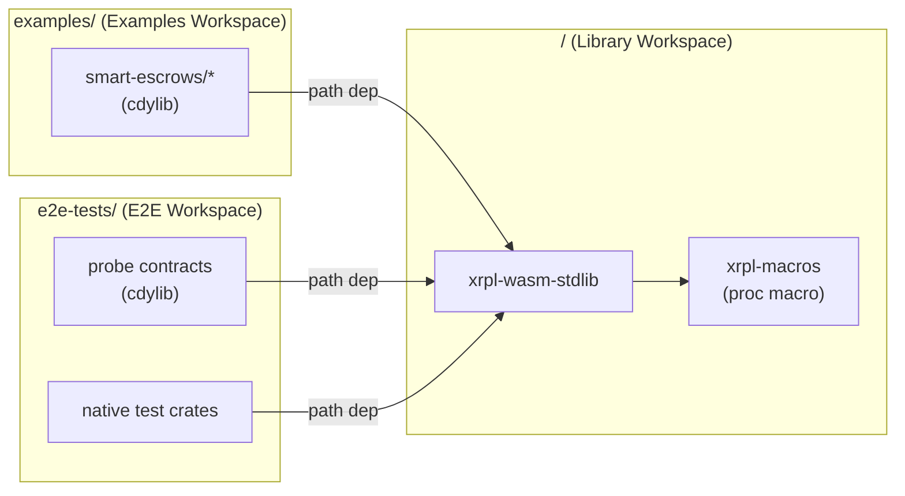
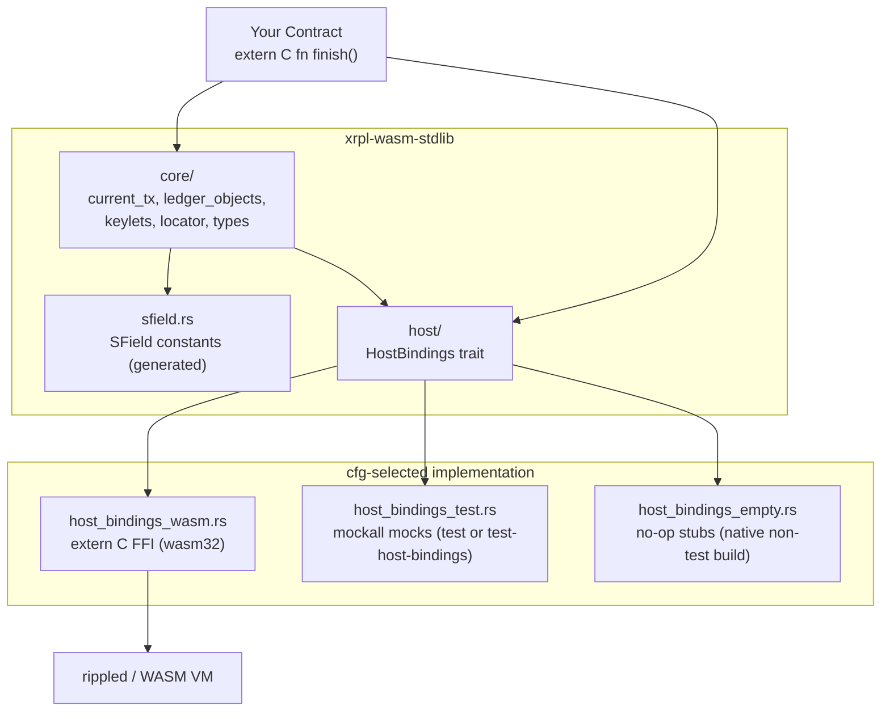

## Architecture

This doc introduces new developers to the `xrpl_wasm_stdlib` repo.

### Overview

`xrpl-wasm-stdlib` is a Rust `no_std` library for writing XRPL smart contracts compiled to WebAssembly. Contracts are loaded by `rippled`, which exposes a host ABI the library wraps. The library provides type-safe access to transaction fields, ledger objects, keylets, and serialized fields.

A minimal contract exports `extern "C" fn finish() -> i32`. A positive return value finishes the escrow, `0` rejects it, and a negative value signals a host error.

---

### Workspace layout

The repo is laid out in three separate Cargo workspaces:

#### Library

Path: `/Cargo.toml`

Builds `xrpl-wasm-stdlib` and `xrpl-macros`. Targets native + wasm32.

#### Examples

Path: `examples/Cargo.toml`

Builds example smart escrow `.wasm` contracts. Targets wasm32v1-none.

#### E2E Tests

Path: `e2e-tests/Cargo.toml`

Builds probe contracts and native test crates. Target is mixed.



---

### Library layers

The library is split into two layers. Contract authors work with `core/`. The `host/` layer is internal.



`core/` is the public-facing API. `host/` is the boundary between safe Rust and the host ABI.

---

### Host binding swap

`host/mod.rs` selects one of three implementations of the `HostBindings` trait at compile time:

| Target / Feature                                | File                     | Used for                            |
| ----------------------------------------------- | ------------------------ | ----------------------------------- |
| `cfg(target_arch = "wasm32")`                   | `host_bindings_wasm.rs`  | Production WASM builds              |
| `cfg(test)` or `feature = "test-host-bindings"` | `host_bindings_test.rs`  | Unit tests and coverage             |
| Native build (default)                          | `host_bindings_empty.rs` | Compiling on the host without tests |

Anything added to `HostBindings` must be implemented in all three files. CI's `host-function-audit.sh` compares the trait against rippled's exports.

To use mocks from another crate's tests (e.g. `e2e-tests/`), enable the `test-host-bindings` feature on `xrpl-wasm-stdlib`. `dev-dependencies` alone are not enough because `mockall` must be available when the lib is consumed as a regular dep.

---

### SField system

`sfield.rs` is generated by `scripts/generate-sfields.sh` and must not be hand-edited. It defines `SField<T, CODE>` constants where `T` is a const-generic phantom encoding the Rust type. This lets `core` functions infer the return type from the field constant:

```rust
current_tx::get_field(sfield::Account)   // infers AccountID
ledger_object::get_field(slot, sfield::Balance)  // infers Amount
```

Custom type overrides (e.g. `TransactionType`, `ConditionBlob`, `FulfillmentBlob`) live in `tools/generateSFields.js`.

`xrpl-macros` exports `r_address!("r...")`, which converts an XRPL base58 r-address to a `[u8; 20]` AccountID at compile time.

---

### Source layout

```
xrpl-wasm-stdlib/src/
├── lib.rs               # no_std toggle, panic_handler (wasm32), hex helpers
├── host/                # HostBindings trait + 3 impls, error codes, trace, field_helpers
├── core/
│   ├── current_tx/      # EscrowFinish marker + traits for current TX field access
│   ├── ledger_objects/  # Cached ledger entry access (Escrow, AccountRoot, etc.)
│   ├── keylets.rs       # Keylet computation (escrow, oracle, credential, ...)
│   ├── locator.rs       # Nested-field locator paths for get_*_nested_field
│   ├── types/           # AccountID, Amount, Hash*, Blob, NFT, OpaqueFloat, etc.
│   └── constants.rs
├── sfield.rs            # GENERATED - do not edit by hand
└── types.rs             # Top-level type re-exports
```

---

### Build targets

Both the root and `examples/` workspaces use the same release profile optimized for size:

```toml
opt-level = "s"
lto = true
codegen-units = 1
panic = "abort"
```

The library registers a `#[panic_handler]` for `wasm32` that calls `wasm32::unreachable()`. The dev profile uses `panic = "unwind"` so unit tests can run on the host.

`lib.rs` uses `#![cfg_attr(target_arch = "wasm32", no_std)]`, so the crate is `no_std` only when targeting WASM. Native builds get `std`, which allows `cargo test` to work.

---

### Integration tests

Each example has a `runTest.js` next to its `Cargo.toml`. `scripts/run-tests.sh` walks all workspace members and runs:

```
node tests/runSingleTest.js <dir> <release_wasm_path> [endpoint]
```

The WASM path is `{examples,e2e-tests}/target/wasm32v1-none/release/<crate>.wasm`. Directories under `e2e-tests/` without a `runTest.js` are silently skipped.
