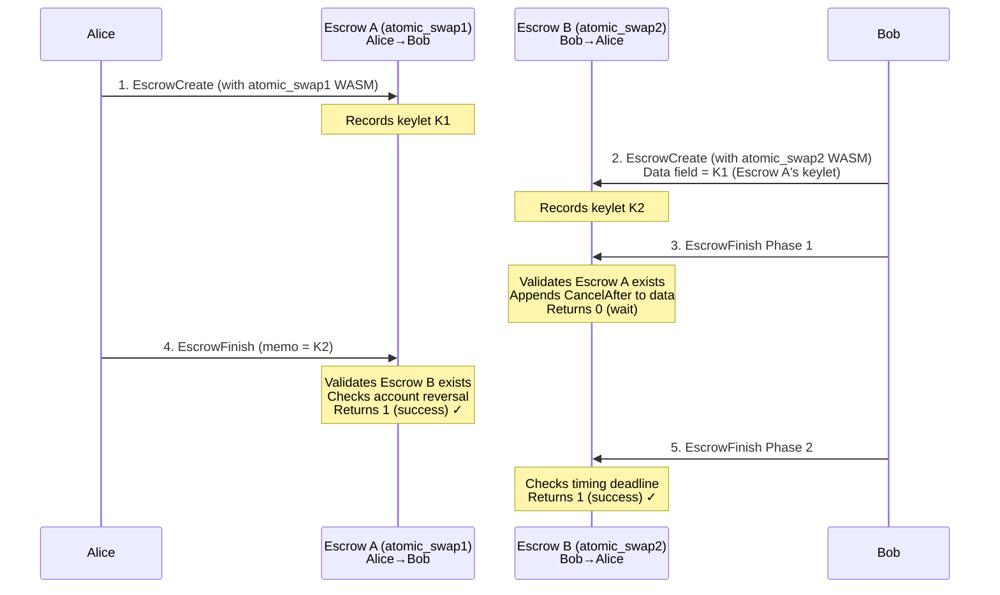
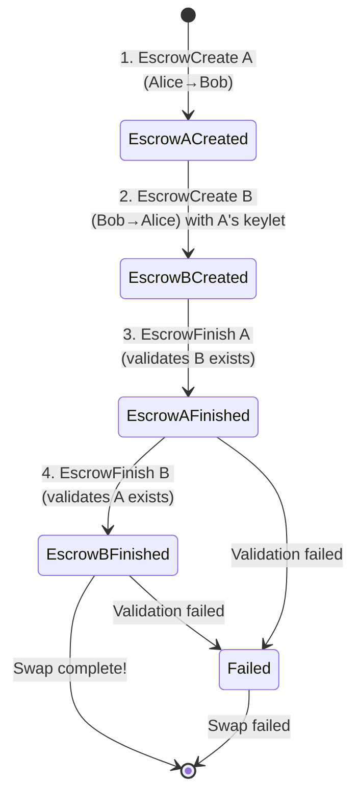

# Atomic Swap Examples

Smart escrow examples demonstrating trustless atomic swaps between two parties on the XRPL.

## What is an Atomic Swap?

An atomic swap is a trustless exchange mechanism where two parties can swap assets without intermediaries. Either both swaps complete successfully, or neither does - there's no partial execution.

## When to use Atomic Swaps?

- **Token exchanges** between parties who don't trust each other
- **Cross-chain coordination** where you need atomic completion
- **Trustless trading** without intermediaries
- **Coordinated settlements** requiring automatic timing validation

## Available Examples

| Example                         | Description                                     |
| ------------------------------- | ----------------------------------------------- |
| [atomic_swap1](./atomic_swap1/) | Memo-based validation with keylet references    |
| [atomic_swap2](./atomic_swap2/) | Data field-based validation with timing control |

## System Flow Diagram



## System State Diagram

This diagram shows the complete atomic swap flow with all 4 transactions:



## Common Transaction Patterns

### EscrowCreate Format

```json
{
  "TransactionType": "EscrowCreate",
  "Account": "[SENDER_ADDRESS]",
  "Destination": "[RECEIVER_ADDRESS]",
  "Amount": "[AMOUNT_IN_DROPS]",
  "CancelAfter": "[UNIX_TIMESTAMP]",
  "FinishFunction": "[WASM_HEX]"
}
```

### EscrowFinish Format

```json
{
  "TransactionType": "EscrowFinish",
  "Account": "[FINISHER_ADDRESS]",
  "Owner": "[ESCROW_OWNER_ADDRESS]",
  "OfferSequence": "[ESCROW_SEQUENCE_NUMBER]",
  "ComputationAllowance": 1000000
}
```

## Common Failure Scenarios

| Scenario                       | Result             |
| ------------------------------ | ------------------ |
| Missing memo/data              | Escrow fails       |
| Wrong keylet reference         | Escrow fails       |
| Counterpart escrow not found   | Escrow fails       |
| Accounts not properly reversed | Escrow fails       |
| One escrow already consumed    | Other escrow fails |

## Important Notes

⚠️ **Timing**: Both escrows should be finished quickly after each other. Once one escrow is consumed, the counterpart becomes unreferenceable.

⚠️ **Coordination**: In practice, both parties should submit their `EscrowFinish` transactions in the same ledger or use coordination mechanisms.

## Building

### Prerequisites

- Rust with `wasm32v1-none` target
- XRPL WASM standard library

### Build Commands

```shell
# Build a specific example
cd atomic_swap1  # or atomic_swap2
cargo build --target wasm32v1-none --release
```

## Production Considerations

To make these examples production-grade, you would want to implement:

### Enhanced Validation

- **CancelAfter validation**: Verify that the counterpart's CancelAfter is in the future
- **Stricter data format validation**: Reject memos/data with unexpected lengths or formats
- **Counterpart data field validation**: Verify counterpart's data contains expected values

### Cryptographic Security

- **Hash-based WASM validation**: Replace magic number checks with SHA256 hash verification
- **Signature verification**: Require cryptographic signatures from both parties

### Robustness

- **Ledger time sanity checks**: Validate that current_time is reasonable
- **Comprehensive error recovery**: Implement retry logic and state recovery procedures
- **Timeout handling**: Handle cases where one party never submits their EscrowFinish

### Operational

- **Monitoring and alerting**: Add metrics for swap success/failure rates
- **Rate limiting**: Prevent abuse of the atomic swap mechanism
- **Audit logging**: Log all phase transitions and validation failures
