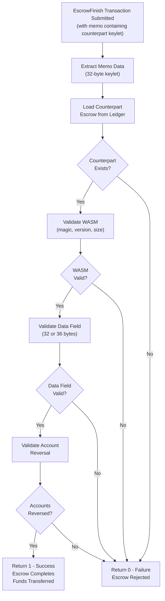

# Atomic Swap 1: Memo-Based Smart Escrow

A smart escrow for atomic swaps where each escrow validates its counterpart using memo data.

## What is it?

This escrow enables trustless atomic swaps between two parties. Each escrow must reference its counterpart's keylet in the transaction memo. The escrow only releases funds if:

1. A valid counterpart escrow keylet is provided in the memo
2. The counterpart escrow exists on the ledger
3. The accounts are properly reversed (A→B references B→A)

This ensures both escrows complete together or neither completes at all.

## Step-by-Step Transaction Guide

This guide shows how to manually create and execute an atomic swap using the WASM Devnet or direct transaction submission.

### Step 1: Create First Escrow (Alice → Bob)

**EscrowCreate Transaction:**

```json
{
  "TransactionType": "EscrowCreate",
  "Account": "rAlice...",
  "Destination": "rBob...",
  "Amount": "1000000",
  "CancelAfter": 2000000000,
  "FinishFunction": "ATOMIC_SWAP1_WASM_HEX_HERE"
}
```

**Expected Result:**

- Transaction succeeds with `tesSUCCESS`
- Note the `Sequence` number (e.g., `123`)
- Extract escrow keylet from transaction metadata `AffectedNodes[].CreatedNode.LedgerIndex`

### Step 2: Create Second Escrow (Bob → Alice)

**EscrowCreate Transaction:**

```json
{
  "TransactionType": "EscrowCreate",
  "Account": "rBob...",
  "Destination": "rAlice...",
  "Amount": "2000000",
  "CancelAfter": 2000000000,
  "FinishFunction": "ATOMIC_SWAP1_WASM_HEX_HERE"
}
```

**Expected Result:**

- Transaction succeeds with `tesSUCCESS`
- Note the `Sequence` number (e.g., `456`)
- Extract escrow keylet from transaction metadata

### Step 3: Execute Atomic Swap - First Escrow

**EscrowFinish Transaction:**

```json
{
  "TransactionType": "EscrowFinish",
  "Account": "rAlice...",
  "Owner": "rAlice...",
  "OfferSequence": 123,
  "ComputationAllowance": 1000000,
  "Memos": [
    {
      "Memo": {
        "MemoType": "636F756E746572706172745F657363726F77",
        "MemoData": "SECOND_ESCROW_KEYLET_32_BYTES_HEX"
      }
    }
  ]
}
```

**Key Details:**

- `MemoType`: `"counterpart_escrow"` converted to hex = `"636F756E746572706172745F657363726F77"`
- `MemoData`: Use the keylet from Step 2's transaction metadata
- `OfferSequence`: Use sequence number from Step 1

**Expected Result:**

- Transaction succeeds with `tesSUCCESS`
- Escrow 1 is finished and Alice receives Bob's funds
- Trace shows successful counterpart validation

### Step 4: Execute Atomic Swap - Second Escrow (Optional)

⚠️ **Important**: This will likely fail because Escrow 1 was already finished in Step 3.

**EscrowFinish Transaction:**

```json
{
  "TransactionType": "EscrowFinish",
  "Account": "rBob...",
  "Owner": "rBob...",
  "OfferSequence": 456,
  "ComputationAllowance": 1000000,
  "Memos": [
    {
      "Memo": {
        "MemoType": "636F756E746572706172745F657363726F77",
        "MemoData": "FIRST_ESCROW_KEYLET_32_BYTES_HEX"
      }
    }
  ]
}
```

**Expected Result:**

- Transaction fails with `tecWASM_REJECTED`
- Trace shows "Failed to cache counterpart escrow, error: -10"
- This demonstrates the atomic nature - once one escrow is finished, the other cannot complete

## Configuration

The contract expects:

- **Counterpart Keylet**: 32-byte escrow keylet in transaction memo
- **Reversed Accounts**: Current escrow must have accounts reversed from counterpart
- **Valid Counterpart**: Referenced escrow must exist and be accessible

## Building

```shell
cargo build --target wasm32v1-none --release
```

The resulting WASM file will be located at `./target/wasm32v1-none/release/atomic_swap1.wasm`

## Testing

```shell
cd ../../../../
CI=1 ./scripts/run-tests.sh examples/smart-escrows/atomic_swap/atomic_swap1
```

## How It Works - Implementation Details

### Validation Steps

1. **Memo Extraction**: Retrieves counterpart escrow keylet from transaction memo (32 bytes)
2. **Counterpart Loading**: Loads the referenced escrow from the ledger
3. **WASM Validation**: Confirms counterpart uses atomic_swap2 contract (magic number, version, size checks)
4. **Data Field Validation**: Verifies counterpart's data field is valid (32 or 36 bytes)
5. **Account Reversal**: Validates that accounts are properly reversed:
   - Current escrow's account == Counterpart's destination
   - Current escrow's destination == Counterpart's account
6. **Completion**: Returns 1 (success) if all validations pass, allowing escrow to complete

### Security Features

- **Mutual Validation**: Both escrows must validate each other before completing
- **WASM Verification**: Prevents accepting wrong contracts with correct headers
- **Account Reversal Check**: Ensures escrows are properly paired (A→B with B→A)
- **Keylet-Based References**: Uses immutable ledger object identifiers for precise targeting

## Execution Flow Diagram



## Important Notes

⚠️ **Memo Format**: The memo must contain exactly the 32-byte keylet of the counterpart escrow. Extra data is ignored but should be avoided.
