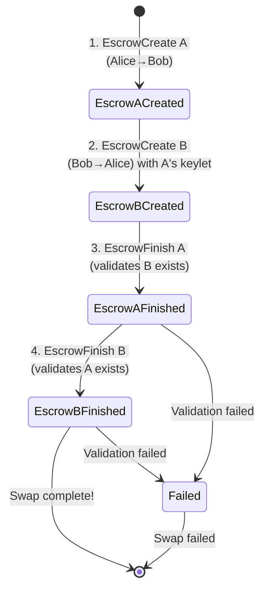

# Atomic Swap 1: Memo-Based Smart Escrow

A smart escrow for atomic swaps where each escrow validates its counterpart using memo data.

## What is it?

This escrow enables trustless atomic swaps between two parties. Each escrow must reference its counterpart's keylet in the transaction memo. The escrow only releases funds if:

1. A valid counterpart escrow keylet is provided in the memo
2. The counterpart escrow exists on the ledger
3. The accounts are properly reversed (A→B references B→A)

This ensures both escrows complete together or neither completes at all.

## When to use it?

- **Token exchanges** between parties who don't trust each other
- **Cross-chain coordination** where you need atomic completion
- **Trustless trading** without intermediaries
- **Simple atomic swaps** that don't require complex timing logic

## Step-by-Step Transaction Guide

This guide shows how to manually create and execute an atomic swap using the WASM Devnet or direct transaction submission.

### Step 1: Create First Escrow (Alice → Bob)

**EscrowCreate Transaction:**

```json
{
  "TransactionType": "EscrowCreate",
  "Account": "rAlice...",
  "Destination": "rBob...",
  "Amount": "1000000",
  "CancelAfter": 2000000000,
  "FinishFunction": "ATOMIC_SWAP1_WASM_HEX_HERE"
}
```

**Expected Result:**

- Transaction succeeds with `tesSUCCESS`
- Note the `Sequence` number (e.g., `123`)
- Extract escrow keylet from transaction metadata `AffectedNodes[].CreatedNode.LedgerIndex`

### Step 2: Create Second Escrow (Bob → Alice)

**EscrowCreate Transaction:**

```json
{
  "TransactionType": "EscrowCreate",
  "Account": "rBob...",
  "Destination": "rAlice...",
  "Amount": "2000000",
  "CancelAfter": 2000000000,
  "FinishFunction": "ATOMIC_SWAP1_WASM_HEX_HERE"
}
```

**Expected Result:**

- Transaction succeeds with `tesSUCCESS`
- Note the `Sequence` number (e.g., `456`)
- Extract escrow keylet from transaction metadata

### Step 3: Execute Atomic Swap - First Escrow

**EscrowFinish Transaction:**

```json
{
  "TransactionType": "EscrowFinish",
  "Account": "rAlice...",
  "Owner": "rAlice...",
  "OfferSequence": 123,
  "ComputationAllowance": 1000000,
  "Memos": [
    {
      "Memo": {
        "MemoType": "636F756E746572706172745F657363726F77",
        "MemoData": "SECOND_ESCROW_KEYLET_32_BYTES_HEX"
      }
    }
  ]
}
```

**Key Details:**

- `MemoType`: `"counterpart_escrow"` converted to hex = `"636F756E746572706172745F657363726F77"`
- `MemoData`: Use the keylet from Step 2's transaction metadata
- `OfferSequence`: Use sequence number from Step 1

**Expected Result:**

- Transaction succeeds with `tesSUCCESS`
- Escrow 1 is consumed and Alice receives Bob's funds
- Trace shows successful counterpart validation

### Step 4: Execute Atomic Swap - Second Escrow (Optional)

⚠️ **Important**: This will likely fail because Escrow 1 was already consumed in Step 3.

**EscrowFinish Transaction:**

```json
{
  "TransactionType": "EscrowFinish",
  "Account": "rBob...",
  "Owner": "rBob...",
  "OfferSequence": 456,
  "ComputationAllowance": 1000000,
  "Memos": [
    {
      "Memo": {
        "MemoType": "636F756E746572706172745F657363726F77",
        "MemoData": "FIRST_ESCROW_KEYLET_32_BYTES_HEX"
      }
    }
  ]
}
```

**Expected Result:**

- Transaction fails with `tecWASM_REJECTED`
- Trace shows "Failed to cache counterpart escrow, error: -10"
- This demonstrates the atomic nature - once one escrow is consumed, the other cannot complete

### Transaction Structure Reference

**EscrowCreate Format:**

```json
{
  "TransactionType": "EscrowCreate",
  "Account": "[SENDER_ADDRESS]",
  "Destination": "[RECEIVER_ADDRESS]",
  "Amount": "[AMOUNT_IN_DROPS]",
  "CancelAfter": "[UNIX_TIMESTAMP]",
  "FinishFunction": "[WASM_HEX]"
}
```

**EscrowFinish Format:**

```json
{
  "TransactionType": "EscrowFinish",
  "Account": "[FINISHER_ADDRESS]",
  "Owner": "[ESCROW_OWNER_ADDRESS]",
  "OfferSequence": "[ESCROW_SEQUENCE_NUMBER]",
  "ComputationAllowance": 1000000,
  "Memos": [
    {
      "Memo": {
        "MemoType": "636F756E746572706172745F657363726F77",
        "MemoData": "[COUNTERPART_ESCROW_KEYLET_HEX]"
      }
    }
  ]
}
```

## Configuration

The contract expects:

- **Counterpart Keylet**: 32-byte escrow keylet in transaction memo
- **Reversed Accounts**: Current escrow must have accounts reversed from counterpart
- **Valid Counterpart**: Referenced escrow must exist and be accessible

## Building

### Prerequisites

- Rust with `wasm32v1-none` target
- XRPL WASM standard library

### Build Commands

```shell
cargo build --target wasm32v1-none
cargo build --target wasm32v1-none --release
```

The resulting WASM file will be located at:

```
./target/wasm32v1-none/release/atomic_swap1.wasm
```

## Testing

```shell
cd ../../../
CI=1 ./scripts/run-tests.sh examples/smart-escrows/atomic_swap1
```

## How It Works - Implementation Details

### Validation Steps

1. **Memo Extraction**: Retrieves counterpart escrow keylet from transaction memo (32 bytes)
2. **Counterpart Loading**: Loads the referenced escrow from the ledger
3. **WASM Validation**: Confirms counterpart uses atomic_swap2 contract (magic number, version, size checks)
4. **Data Field Validation**: Verifies counterpart's data field is valid (32 or 36 bytes)
5. **Account Reversal**: Validates that accounts are properly reversed:
   - Current escrow's account == Counterpart's destination
   - Current escrow's destination == Counterpart's account
6. **Completion**: Returns 1 (success) if all validations pass, allowing escrow to complete

### Security Features

- **Mutual Validation**: Both escrows must validate each other before completing
- **WASM Verification**: Prevents accepting wrong contracts with correct headers
- **Account Reversal Check**: Ensures escrows are properly paired (A→B with B→A)
- **Keylet-Based References**: Uses immutable ledger object identifiers for precise targeting

## System State Diagram

This diagram shows the complete atomic swap flow with all 4 transactions:



## Execution Flow Diagram


## Important Notes

⚠️ **Timing**: Both escrows should be finished quickly after each other. Once one escrow is consumed, the counterpart becomes unreferenceable.

⚠️ **Coordination**: In practice, both parties should submit their `EscrowFinish` transactions in the same ledger or use coordination mechanisms.

⚠️ **Memo Format**: The memo must contain exactly the 32-byte keylet of the counterpart escrow. Extra data is ignored but should be avoided.

## What can go wrong?

| Scenario                       | Result             |
| ------------------------------ | ------------------ |
| Missing memo                   | Escrow fails       |
| Wrong keylet in memo           | Escrow fails       |
| Counterpart escrow not found   | Escrow fails       |
| Accounts not properly reversed | Escrow fails       |
| One escrow already consumed    | Other escrow fails |

## Complete Atomic Swap

This escrow is designed to work **with other escrows** to create complete atomic swaps. For example:

- **Escrow A** (Alice→Bob): Uses this memo-based contract, references Escrow B's keylet
- **Escrow B** (Bob→Alice): Uses any contract (including atomic_swap2), both validate each other

The atomic_swap2 example shows a different validation approach using data fields and timing, but both examples demonstrate the same principle: **mutual validation between escrows**.

## Production Considerations

To make this example production-grade, you would want to implement:

### Enhanced Validation

- **CancelAfter validation**: Verify that the counterpart's CancelAfter is in the future to prevent accepting already-expired escrows
- **Counterpart data field validation**: Verify that the counterpart's data field contains the expected keylet, adding a layer of defense against misconfigured escrows
- **Stricter memo format validation**: Reject memos with extra bytes to prevent accidental data corruption

### Cryptographic Security

- **Hash-based WASM validation**: Replace the current magic number check with SHA256 hash verification against known good versions, preventing acceptance of wrong WASM with correct headers
- **Signature verification**: Consider requiring cryptographic signatures from both parties to prevent unauthorized escrow creation

### Robustness

- **Ledger time sanity checks**: Validate that current_time is reasonable (not 0, not in far future) to catch unexpected ledger state
- **Comprehensive error recovery**: Implement retry logic and state recovery procedures for edge cases
- **Timeout handling**: Implement mechanisms to handle cases where one party never submits their EscrowFinish

### Operational

- **Failure scenario documentation**: Document what happens if one escrow expires before the other completes, and implement recovery procedures
- **Monitoring and alerting**: Add metrics for swap success/failure rates and alert on anomalies
- **Rate limiting**: Implement rate limiting to prevent abuse of the atomic swap mechanism
