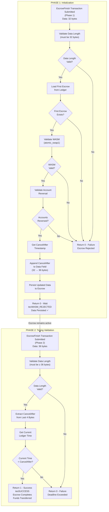

# Atomic Swap 2: Data Field-Based Smart Escrow

A smart escrow for atomic swaps with built-in timing validation and two-phase execution.

## What is it?

This escrow enables atomic swaps using a two-phase execution model with automatic timing control. The escrow stores state in its data field and executes in two phases:

1. **Phase 1**: Validates the referenced escrow exists and sets a timing deadline
2. **Phase 2**: Checks if we're still within the deadline and completes the swap

This approach provides built-in timing coordination and prevents stale swap attempts.

## When to use it?

- **Timed exchanges** that must complete within a deadline
- **Coordinated settlements** requiring automatic timing validation
- **Sequential workflows** where you need state persistence between executions
- **Deadline-sensitive trades** that should expire after a certain time

## How it works

**Setup**: Create an escrow with the first escrow's keylet in the data field.

**Phase 1**: First `EscrowFinish` validates the referenced escrow exists, appends timing data, and returns "wait".

**Phase 2**: Second `EscrowFinish` checks if we're within the deadline and completes if valid.

## Step-by-Step Transaction Guide

This guide shows how to manually create and execute a data field-based atomic swap using the WASM Devnet or direct transaction submission.

### Step 1: Create First Escrow (Regular Escrow)

**EscrowCreate Transaction:**

```json
{
  "TransactionType": "EscrowCreate",
  "Account": "rAlice...",
  "Destination": "rBob...",
  "Amount": "1000000",
  "CancelAfter": 2000000000,
  "FinishFunction": "REGULAR_WASM_HEX_OR_EMPTY"
}
```

**Expected Result:**

- Transaction succeeds with `tesSUCCESS`
- Note the `Sequence` number (e.g., `123`)
- Extract escrow keylet from transaction metadata `AffectedNodes[].CreatedNode.LedgerIndex`

### Step 2: Create Second Escrow (Atomic Swap 2 with Data Field)

**EscrowCreate Transaction:**

```json
{
  "TransactionType": "EscrowCreate",
  "Account": "rBob...",
  "Destination": "rAlice...",
  "Amount": "2000000",
  "CancelAfter": 2000000000,
  "FinishFunction": "ATOMIC_SWAP2_WASM_HEX_HERE",
  "Data": "FIRST_ESCROW_KEYLET_32_BYTES_HEX"
}
```

**Key Details:**

- `Data`: Use the keylet from Step 1's transaction metadata (32 bytes hex)
- `CancelAfter`: Must be set - this becomes the swap deadline
- `FinishFunction`: Use the compiled atomic_swap2.wasm

**Expected Result:**

- Transaction succeeds with `tesSUCCESS`
- Note the `Sequence` number (e.g., `456`)

### Step 3: Execute First Phase - Initialize Timing

**EscrowFinish Transaction (Phase 1):**

```json
{
  "TransactionType": "EscrowFinish",
  "Account": "rBob...",
  "Owner": "rBob...",
  "OfferSequence": 456,
  "ComputationAllowance": 1000000
}
```

**Expected Result:**

- Transaction succeeds with `tesSUCCESS` but escrow does NOT complete yet
- Trace shows "Phase 1: Initialized timing data"
- Escrow data field is updated with CancelAfter timestamp
- Contract returns `0` to indicate "wait for phase 2"

### Step 4: Execute Second Phase - Complete Swap

**EscrowFinish Transaction (Phase 2):**

```json
{
  "TransactionType": "EscrowFinish",
  "Account": "rBob...",
  "Owner": "rBob...",
  "OfferSequence": 456,
  "ComputationAllowance": 1000000
}
```

**Expected Result (if within deadline):**

- Transaction succeeds with `tesSUCCESS`
- Escrow 2 is consumed and Alice receives Bob's funds
- Trace shows "Phase 2: Completed within deadline"

**Expected Result (if deadline exceeded):**

- Transaction succeeds with `tesSUCCESS` but escrow fails to complete
- Trace shows "Phase 2: Deadline exceeded"
- Contract returns `0` indicating timing failure

### Two-Phase Execution Example

**Data Field Evolution:**

_Initial State (at creation):_

```
Data: [First Escrow Keylet - 32 bytes]
Length: 32 bytes
```

_After Phase 1:_

```
Data: [First Escrow Keylet - 32 bytes][CancelAfter - 4 bytes]
Length: 36 bytes
```

_Phase 2 reads the last 4 bytes as deadline timestamp_

## Transaction Structure Reference

### EscrowCreate (Setup)

```json
{
  "TransactionType": "EscrowCreate",
  "Account": "[SENDER_ADDRESS]",
  "Destination": "[RECEIVER_ADDRESS]",
  "Amount": "[AMOUNT_IN_DROPS]",
  "CancelAfter": "[UNIX_TIMESTAMP]",
  "FinishFunction": "[ATOMIC_SWAP2_WASM_HEX]",
  "Data": "[FIRST_ESCROW_KEYLET_32_BYTES_HEX]"
}
```

### EscrowFinish (Execution)

```json
{
  "TransactionType": "EscrowFinish",
  "Account": "[FINISHER_ADDRESS]",
  "Owner": "[ESCROW_OWNER_ADDRESS]",
  "OfferSequence": "[ESCROW_SEQUENCE_NUMBER]",
  "ComputationAllowance": 1000000
}
```

## Building

### Prerequisites

- Rust with `wasm32v1-none` target
- XRPL WASM standard library

### Build Commands

```shell
cargo build --target wasm32v1-none
cargo build --target wasm32v1-none --release
```

The resulting WASM file will be located at:

```
./target/wasm32v1-none/release/atomic_swap2.wasm
```

## Testing

```shell
cd ../../../
CI=1 ./scripts/run-tests.sh examples/smart-escrows/atomic_swap2
```

## How It Works - Implementation Details

### Phase 1 Execution

1. **Data Validation**: Verifies data field contains exactly 32 bytes (first escrow keylet)
2. **Counterpart Verification**: Loads and validates the first escrow exists on the ledger
3. **WASM Validation**: Confirms first escrow uses atomic_swap1 contract
4. **Account Reversal**: Validates proper account setup between escrows
5. **Timing Setup**: Retrieves current escrow's CancelAfter as the swap deadline
6. **Data Persistence**: Appends CancelAfter timestamp to data field (36 bytes total)
7. **Result**: Returns 0 (failure) but data persists - escrow remains active for Phase 2

### Phase 2 Execution

1. **Data Extraction**: Retrieves the CancelAfter timestamp from last 4 bytes of data
2. **Time Check**: Gets current ledger time and compares against deadline
3. **Completion**: Returns 1 (success) if within deadline, 0 (failure) if expired

## Two-Phase State Machine Diagram



## Important Notes

⚠️ **Two Executions Required**: You must call `EscrowFinish` twice - once for each phase.

⚠️ **Timing**: The deadline is set from the escrow's `CancelAfter` field during Phase 1. Phase 2 must execute before this deadline.

⚠️ **Data Field**: Must contain exactly 32 bytes (the first escrow's keylet) when creating the escrow.

⚠️ **Phase 2 Data Consistency**: The first 32 bytes of the data field are re-validated in Phase 2 to ensure they haven't been tampered with.

## What can go wrong?

| Scenario                    | Phase | Result       |
| --------------------------- | ----- | ------------ |
| Wrong data field length     | 1     | Escrow fails |
| Referenced escrow not found | 1     | Escrow fails |
| Missing CancelAfter field   | 1     | Escrow fails |
| Deadline exceeded           | 2     | Escrow fails |

## Complete Atomic Swap

This escrow is designed to work **with other escrows** to create complete atomic swaps. For example:

- **Escrow A** (Alice→Bob): Uses any contract (including atomic_swap1)
- **Escrow B** (Bob→Alice): Uses this data field-based contract, references Escrow A's keylet

The atomic_swap1 example shows a different validation approach using memos, but both examples demonstrate the same principle: **one escrow validates the other exists before completing**.

## Production Considerations

To make this example production-grade, you would want to implement:

### Enhanced Validation

- **Phase 2 data consistency**: Re-validate that the first 32 bytes of the data field still match the first escrow's keylet to detect tampering between phases
- **Counterpart data field validation**: Verify that the first escrow's data field contains the expected values (e.g., this escrow's keylet for bidirectional validation)
- **Stricter data format validation**: Reject data fields with unexpected lengths or formats

### Cryptographic Security

- **Hash-based WASM validation**: Replace the current magic number check with SHA256 hash verification against known good versions, preventing acceptance of wrong WASM with correct headers
- **Signature verification**: Consider requiring cryptographic signatures from both parties to prevent unauthorized escrow creation
- **Keylet validation**: Implement cryptographic verification that keylets are properly formatted and valid

### Robustness

- **Ledger time sanity checks**: Validate that current_time is reasonable (not 0, not in far future) to catch unexpected ledger state
- **CancelAfter validation**: Verify that CancelAfter is in the future during Phase 1 to prevent accepting already-expired deadlines
- **Comprehensive error recovery**: Implement retry logic and state recovery procedures for edge cases
- **Timeout handling**: Implement mechanisms to handle cases where Phase 2 is never executed

### Operational

- **Failure scenario documentation**: Document what happens if one escrow expires before the other completes, and implement recovery procedures
- **Monitoring and alerting**: Add metrics for swap success/failure rates, phase execution times, and alert on anomalies
- **Rate limiting**: Implement rate limiting to prevent abuse of the atomic swap mechanism
- **Audit logging**: Log all phase transitions and validation failures for compliance and debugging
