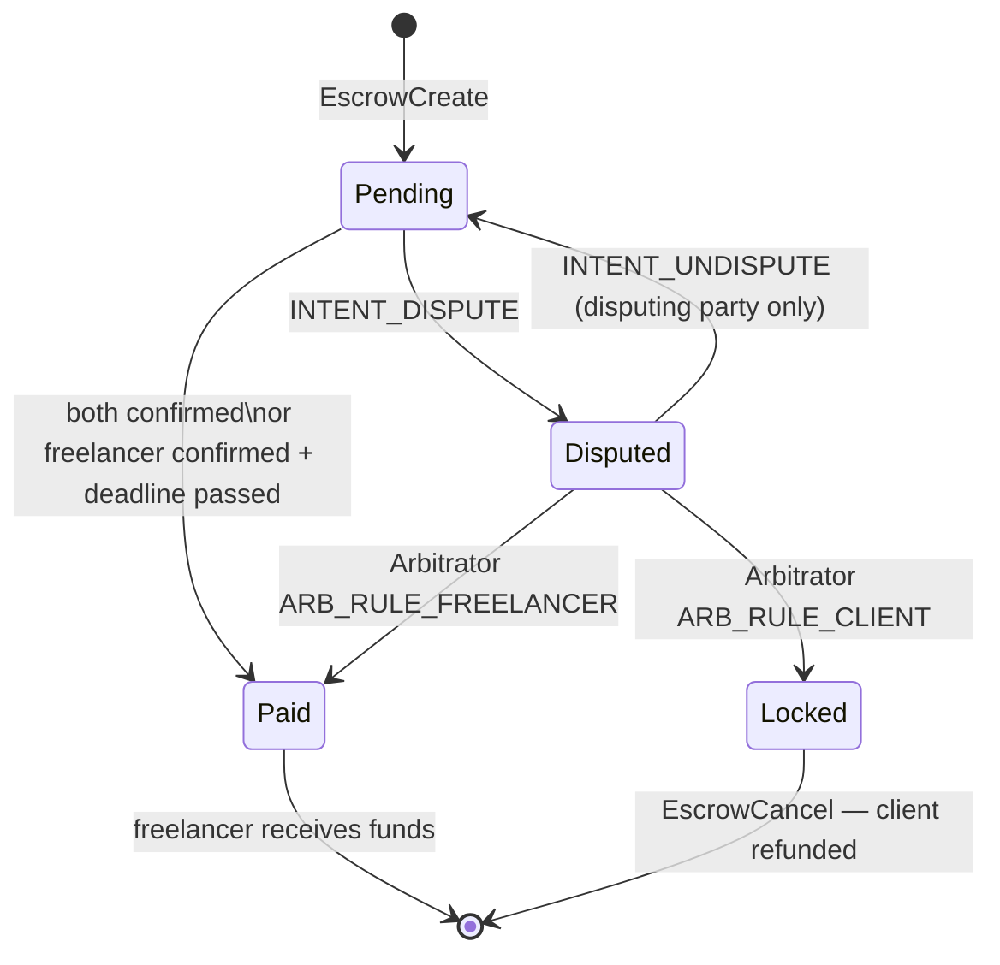
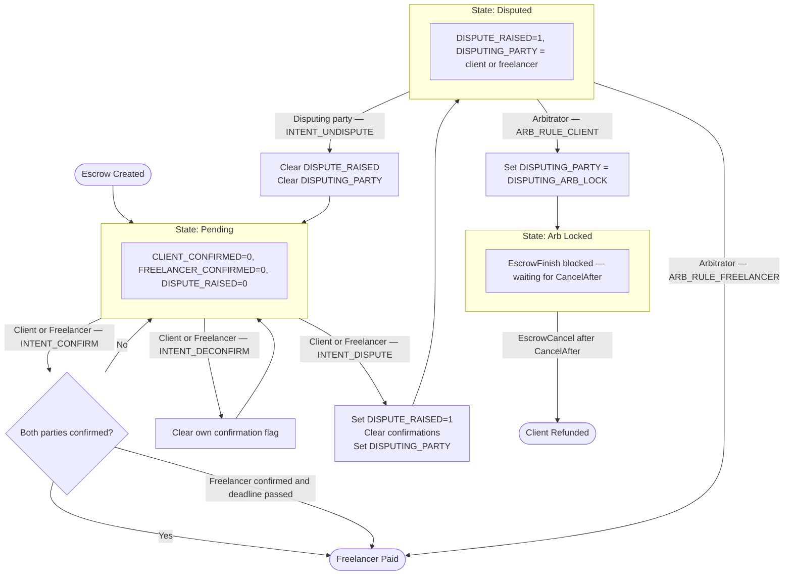
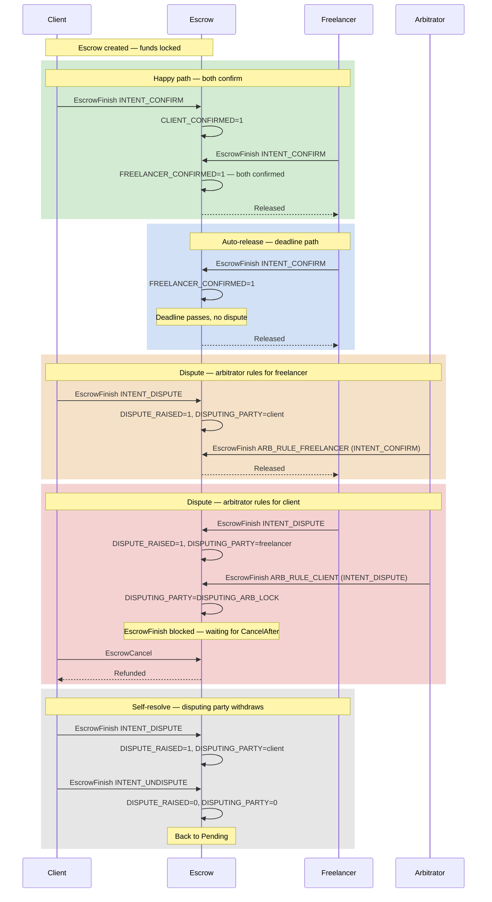

# Freelancer Escrow Flow

## Overview

```mermaid
stateDiagram-v2
    [*] --> Pending: EscrowCreate

    Pending --> Paid: both confirmed\nor freelancer confirmed + deadline passed
    Pending --> Disputed: INTENT_DISPUTE

    Disputed --> Pending: INTENT_UNDISPUTE (disputing party only)
    Disputed --> Paid: Arbitrator ARB_RULE_FREELANCER
    Disputed --> Locked: Arbitrator ARB_RULE_CLIENT

    Paid --> [*]: freelancer receives funds
    Locked --> [*]: EscrowCancel — client refunded
```

## State Flowchart

```mermaid
flowchart TD
    START([Escrow Created])
    START --> PENDING

    subgraph PENDING["State: Pending"]
        P[CLIENT_CONFIRMED=0, FREELANCER_CONFIRMED=0, DISPUTE_RAISED=0]
    end

    PENDING -->|Client or Freelancer — INTENT_CONFIRM| CONFIRM{Both parties confirmed?}
    PENDING -->|Client or Freelancer — INTENT_DECONFIRM| DECONFIRM[Clear own confirmation flag]
    PENDING -->|Client or Freelancer — INTENT_DISPUTE| RAISE[Set DISPUTE_RAISED=1\nClear confirmations\nSet DISPUTING_PARTY]

    DECONFIRM --> PENDING
    CONFIRM -->|Yes| PAID
    CONFIRM -->|Freelancer confirmed and deadline passed| PAID
    CONFIRM -->|No| PENDING

    RAISE --> DISPUTED

    subgraph DISPUTED["State: Disputed"]
        D[DISPUTE_RAISED=1, DISPUTING_PARTY = client or freelancer]
    end

    DISPUTED -->|Disputing party — INTENT_UNDISPUTE| WITHDRAW[Clear DISPUTE_RAISED\nClear DISPUTING_PARTY]
    WITHDRAW --> PENDING
    DISPUTED -->|Arbitrator — ARB_RULE_FREELANCER| PAID
    DISPUTED -->|Arbitrator — ARB_RULE_CLIENT| LOCK[Set DISPUTING_PARTY = DISPUTING_ARB_LOCK]

    LOCK --> LOCKED

    subgraph LOCKED["State: Arb Locked"]
        L[EscrowFinish blocked — waiting for CancelAfter]
    end

    LOCKED -->|EscrowCancel after CancelAfter| REFUNDED

    PAID([Freelancer Paid])
    REFUNDED([Client Refunded])
```

## Swimlane — Scenarios

```mermaid
sequenceDiagram
    participant Client
    participant Escrow
    participant Freelancer
    participant Arbitrator

    Note over Client,Escrow: Escrow created — funds locked

    rect rgb(210, 235, 210)
        Note over Client,Freelancer: Happy path — both confirm
        Client->>Escrow: EscrowFinish INTENT_CONFIRM
        Escrow->>Escrow: CLIENT_CONFIRMED=1
        Freelancer->>Escrow: EscrowFinish INTENT_CONFIRM
        Escrow->>Escrow: FREELANCER_CONFIRMED=1 — both confirmed
        Escrow-->>Freelancer: Released
    end

    rect rgb(210, 225, 245)
        Note over Freelancer,Escrow: Auto-release — deadline path
        Freelancer->>Escrow: EscrowFinish INTENT_CONFIRM
        Escrow->>Escrow: FREELANCER_CONFIRMED=1
        Note over Escrow: Deadline passes, no dispute
        Escrow-->>Freelancer: Released
    end

    rect rgb(245, 225, 200)
        Note over Client,Arbitrator: Dispute — arbitrator rules for freelancer
        Client->>Escrow: EscrowFinish INTENT_DISPUTE
        Escrow->>Escrow: DISPUTE_RAISED=1, DISPUTING_PARTY=client
        Arbitrator->>Escrow: EscrowFinish ARB_RULE_FREELANCER (INTENT_CONFIRM)
        Escrow-->>Freelancer: Released
    end

    rect rgb(245, 210, 210)
        Note over Client,Arbitrator: Dispute — arbitrator rules for client
        Freelancer->>Escrow: EscrowFinish INTENT_DISPUTE
        Escrow->>Escrow: DISPUTE_RAISED=1, DISPUTING_PARTY=freelancer
        Arbitrator->>Escrow: EscrowFinish ARB_RULE_CLIENT (INTENT_DISPUTE)
        Escrow->>Escrow: DISPUTING_PARTY=DISPUTING_ARB_LOCK
        Note over Escrow: EscrowFinish blocked — waiting for CancelAfter
        Client->>Escrow: EscrowCancel
        Escrow-->>Client: Refunded
    end

    rect rgb(230, 230, 230)
        Note over Client,Freelancer: Self-resolve — disputing party withdraws
        Client->>Escrow: EscrowFinish INTENT_DISPUTE
        Escrow->>Escrow: DISPUTE_RAISED=1, DISPUTING_PARTY=client
        Client->>Escrow: EscrowFinish INTENT_UNDISPUTE
        Escrow->>Escrow: DISPUTE_RAISED=0, DISPUTING_PARTY=0
        Note over Escrow: Back to Pending
    end
```
