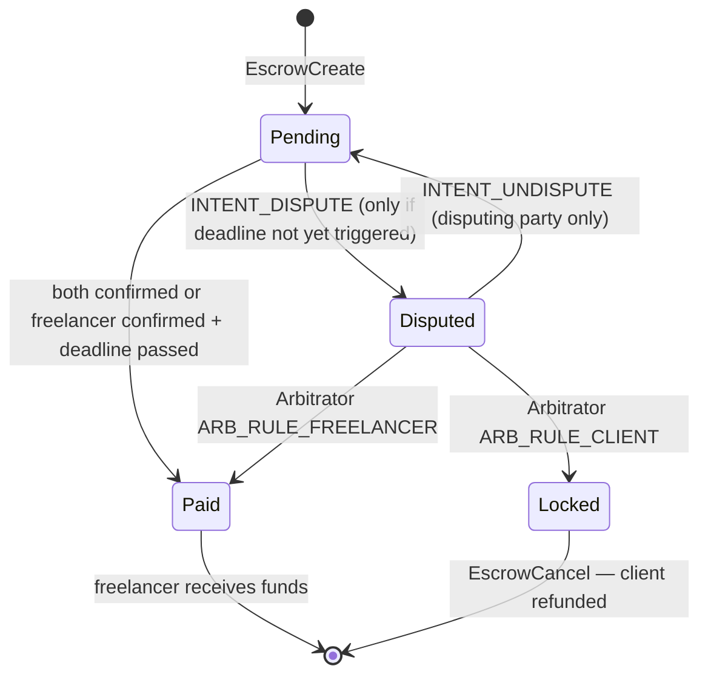
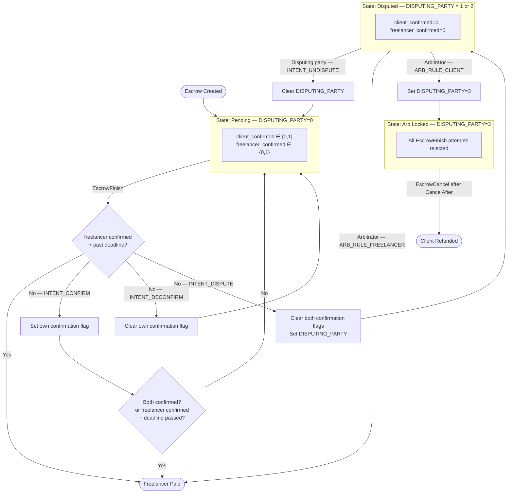
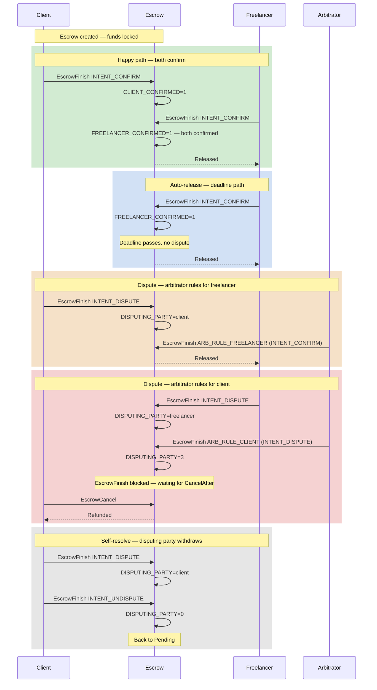

# Freelancer Escrow

> A three-party XRPL smart escrow for freelance payments with built-in dispute arbitration.

## Overview

The freelancer escrow locks a payment on-ledger until either both the client and the freelancer agree the work is done, the freelancer completed their work and the client didn't respond until a deadline, or an arbitrator steps in to resolve a dispute. All protocol state (confirmations, dispute status, arbitrator identity, deadline) is stored in the escrow's 27-byte `Data` field.

Three parties interact with the escrow via `EscrowFinish` transactions, each carrying a one-byte intent in `Memos[0].MemoData`. The escrow is released to the freelancer when both parties confirm, or automatically if the freelancer has confirmed and the deadline has passed. Either party can raise a dispute, handing arbitration control to the arbitrator account encoded in the `Data` field.

This Escrow serves the purpose of ensuring safe handling of funds for all parties involved. External communication between client, freelancer, and arbitrator is required to make sound decisions in the contract. The client is responsible for raising a dispute before the deadline; past it, the freelancer can claim the funds unilaterally.

> **Note — no automatic releases.** Like most blockchains, this contract has no timers; state changes only when an `EscrowFinish` is processed. Once the freelancer has confirmed and the deadline has passed, the auto-release condition is checked before any intent is applied — the next `EscrowFinish` releases to the freelancer regardless of what it asks for, and no intent can undo that. Nothing fires until someone submits an `EscrowFinish`, but once the condition is met, the outcome is fixed.

## Parties & Roles

| Role           | Account                    | Actions                                                                |
| -------------- | -------------------------- | ---------------------------------------------------------------------- |
| **Client**     | `EscrowCreate.Account`     | Confirm, deconfirm, raise dispute, withdraw own dispute                |
| **Freelancer** | `EscrowCreate.Destination` | Confirm, deconfirm, raise dispute, withdraw own dispute                |
| **Arbitrator** | `Data[0..20]`              | Rule for freelancer (release) or for client (lock until `CancelAfter`) |

## Contract Data Layout

The escrow's `Data` field must be exactly 27 bytes, set at `EscrowCreate` time.

| Bytes | Field                  | Type                 | Description                                                                                          |
| ----- | ---------------------- | -------------------- | ---------------------------------------------------------------------------------------------------- |
| 0–19  | `arbitrator`           | AccountID (20 bytes) | Arbitrator account, encoded as raw bytes (not base58)                                                |
| 20–23 | `deadline`             | u32 little-endian    | Ripple epoch seconds; if freelancer has confirmed and ledger time exceeds this, escrow auto-releases |
| 24    | `client_confirmed`     | 0 / 1                | Set when the client sends `INTENT_CONFIRM`                                                           |
| 25    | `freelancer_confirmed` | 0 / 1                | Set when the freelancer sends `INTENT_CONFIRM`                                                       |
| 26    | `disputing_party`      | 0 / 1 / 2 / 3        | `0`=none, `1`=client disputing, `2`=freelancer disputing, `3`=arbitrator locked                      |

`disputing_party > 0` means a dispute is active. There is no separate dispute-raised flag.

## Intents

Each `EscrowFinish` transaction must include the intent byte as the first byte of `Memos[0].MemoData`.

| Byte   | Name               | Sent by              | Effect                                                                                                                          |
| ------ | ------------------ | -------------------- | ------------------------------------------------------------------------------------------------------------------------------- |
| `0x00` | `INTENT_CONFIRM`   | Client or Freelancer | Sets the sender's confirmation flag; releases if both confirmed, or if the freelancer has confirmed and the deadline has passed |
| `0x01` | `INTENT_DECONFIRM` | Client or Freelancer | Clears the sender's confirmation flag                                                                                           |
| `0x02` | `INTENT_DISPUTE`   | Client or Freelancer | Raises a dispute, clears both confirmation flags                                                                                |
| `0x03` | `INTENT_UNDISPUTE` | Disputing party only | Withdraws the sender's own dispute, returning to Pending                                                                        |

The arbitrator uses the same intent byte, but with a different meaning:

| Byte   | Arbitrator ruling     | Effect                                                                            |
| ------ | --------------------- | --------------------------------------------------------------------------------- |
| `0x00` | `ARB_RULE_FREELANCER` | Immediately releases escrow to freelancer                                         |
| `0x02` | `ARB_RULE_CLIENT`     | Locks escrow (`disputing_party=3`); client can `EscrowCancel` after `CancelAfter` |

## State Machine



## State Flowchart



## Scenarios

Six scenarios are covered by the integration tests:

- **Happy path** — client and freelancer both confirm; escrow releases immediately.
- **Auto-release** — freelancer confirms with the deadline already past, or deadline passes after the freelancer has confirmed with no dispute raised; escrow releases.
- **Dispute → arbitrator rules for freelancer** — either party disputes; arbitrator sends `INTENT_CONFIRM`; escrow releases to freelancer.
- **Dispute → arbitrator rules for client** — either party disputes; arbitrator sends `INTENT_DISPUTE`; escrow is locked until `CancelAfter`; client cancels for a refund.
- **Self-resolve** — disputing party changes their mind and sends `INTENT_UNDISPUTE`; escrow returns to Pending.
- **Late dispute → auto-release** — the freelancer has already confirmed and the deadline has passed; a dispute from either party does not enter Disputed state — the auto-release condition takes precedence and the escrow releases to the freelancer.



## Return Values

The `finish()` entry point returns:

| Value | Meaning                                                |
| ----- | ------------------------------------------------------ |
| `> 0` | Escrow finishes — funds released to the freelancer     |
| `0`   | Escrow rejected or state updated — funds remain locked |
| `< 0` | Host error code — transaction fails                    |

## Building

From the repo root:

```shell
cd examples
cargo build -p freelancer_escrow --target wasm32v1-none --release
```

The compiled WASM is written to `examples/target/wasm32v1-none/release/freelancer_escrow.wasm`.

## Running Integration Tests

Requires a local `rippled` node on `ws://localhost:6006` (or set `DEVNET=true` to target Devnet):

```shell
./scripts/run-tests.sh examples/smart-escrows/freelancer_escrow

# Against Devnet
DEVNET=true ./scripts/run-tests.sh examples/smart-escrows/freelancer_escrow
```
